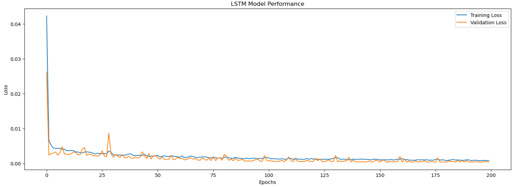
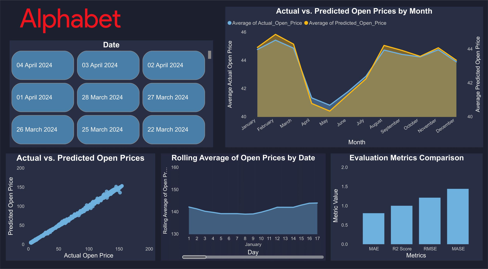

#  💹 Multivariate Stock Price Prediction - LSTM
This project implements a time series multivariate analysis using RNN/LSTM for stock price predictions. A deep RNN model was created and trained on five years of historical Google stock price data to forecast the stock performance over a two-month period.

## 🏗️ High-Level Architecture

## 📌 Features Checklist

- [x] **Multivariate Analysis**: Uses multiple stock features (Open, High, Low, Close, Adjusted Close, Volume) for robust predictions.
- [x] **LSTM-based Approach**: Leverages RNN/LSTM to model sequential dependencies in stock price data.
- [x] **Explainability (SHAP)**: Analyzes feature importance to interpret model decisions.
- [x] **Model Evaluation**: Assesses model performance using RMSE, MAE, and other key metrics.
- [x] **Power BI Charts**: Visualizes stock trends and model predictions with interactive dashboards.
- [ ] **Visualization (TensorBoard)**: Monitors training performance and helps in debugging.
- [ ] **Deployment (TF Serving/AWS)**: Provides a scalable and production-ready model hosting solution.
- [ ] **NLP Integration (FinBERT)**: Enhances predictions by incorporating financial sentiment analysis.

## 🌏 Potential Impact and Applications

- **Investment Strategy Enhancement**: Empowers investors and financial analysts with AI-driven insights to optimize stock market decision-making.  
- **Advanced Risk Management in Trading**: Enables proactive identification of market trends and potential fluctuations, minimizing financial risks.  
- **Scalable & Production-Ready Deployment**: Easily deployable as a REST API for real-time, high-performance stock price prediction applications.  

## 📥 Data Set ([Google Stock Price](https://finance.yahoo.com/quote/GOOG/history))
The dataset utilized comprises historical records for the stock price of [Alphabet Inc. (GOOG)](https://finance.yahoo.com/quote/GOOG/history), captured on daily basis.

The dataset is sourced from [Yahoo Finance](https://finance.yahoo.com/) and contains the following fields: *Opening price, Highest price, Lowest price, Closing price, Adjusted closing price, and Trading volume*.

The raw, interim, and preprocessed datasets can be located in their corresponding subfolders in the main data directory.

## 👨🏾‍💻 Tech Stack
- **Python** 🐍  
- **TensorFlow/Keras** 🔥
- **LSTM**
- **NumPy & Pandas** 📊
- **TensorBoard**
- **Matplotlib** 📉
- **FinBERT - Hugging Face**🤗

## ⚒️ Project Workflow
### PHASE 1 - Explanatory Data Analysis

Implemented data exploration tasks:
1. Download and load the raw dataset file.
2. Explore dataset summary and statistics.
3. Perform initial data cleaning and type validation.
4. Analyze the stock performance data over time.
5. Select a specific period for analysis and filter data accordingly.
6. Store filtered dataset file to a local folder.

### PHASE 2 - Data Preprocessing

Implemented data processing and transformation tasks:
1. Load the filtered dataset file.
2. Validate and correct data types.
3. Select independent and target features.
4. Create training, validation, and testing splits.
5. Scale datasets to a [0,1] range using [MinMaxScaler](https://scikit-learn.org/stable/modules/generated/sklearn.preprocessing.MinMaxScaler.html).
6. Store processed data files (train, validate, test) to a local folder.

### PHASE 3 - Model Training

Implemented training and prediction tasks:
1. Load preprocessed dataset files (train, validate, test).
2. Construct data structures by creating input sequences.
3. Build LSTM Model using [TenserFlow Sequential](https://www.tensorflow.org/api_docs/python/tf/keras/Sequential):
    - First [Input](https://www.tensorflow.org/api_docs/python/tf/keras/layers/InputLayer) layer.
    - 4x [LSTM](https://www.tensorflow.org/api_docs/python/tf/keras/layers/LSTM) layers: units = 100
    - 4x [Dropout](https://www.tensorflow.org/api_docs/python/tf/keras/layers/Dropout) layers: rate = 0.2
    - Final [Dense](https://www.tensorflow.org/api_docs/python/tf/keras/layers/Dense) layer with a single unit.
4. Compile LSTM model:
    - Optimizer: [Adam](https://www.tensorflow.org/api_docs/python/tf/keras/optimizers/Adam)
    - Loss: [Mean Squared Error](https://www.tensorflow.org/api_docs/python/tf/keras/losses/MeanSquaredError)
5. Train LSTM model:
    - Epochs: 200
    - Batch size: 64

### PHASE 4 - Model Inference and Predictions

Evaluate Model Performance:
1. Computed evaluation metrics on the test dataset:
    - **MAE (Mean Absolute Error)**: 0.8055  
    - **RMSE (Root Mean Squared Error)**: 1.2090  
    - **MAPE (Mean Absolute Percentage Error)**: 2.27%  
    - **MASE (Mean Absolute Scaled Error)**: 1.4381  
    - **SMAPE (Symmetric MAPE)**: 2.27%  
    - **R² Score**: 0.9991
2. Visualization of Predictions:
    - **Actual vs Predicted Stock Prices** : Line plot comparing true stock prices vs. predicted values.
    - **Residual Error Distribution** : Histogram or KDE plot of residual errors (actual - predicted).

## 🚀 Model Performance
Below is the loss curve observed during model training:

## 📊 Visualization

Insights from Actual vs. Predicted Open Price in Power BI.

## 👥Development Team
- `Aakaash M S`
- `Karthik Ram S`
- `Aniketha Prasad`
- `Riya Rajesh`

## 🤝 Contributing  
Contributions are welcome! Feel free to fork the repository, work on new features, and submit pull requests.  

## 📝 License  
This project is licensed under the MIT License. 
